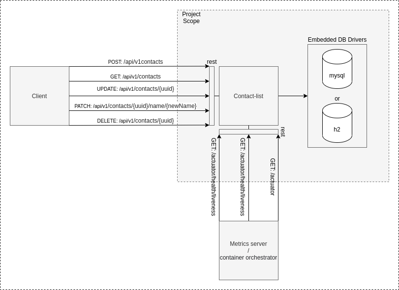

# Contact List
Simple contact list CRUD project using Spring boot for lab purpose.

## Architecture

  

## Prerequisites
:warning: java

:warning: maven

## Usage

:memo: Environment variables necessaries to export:

- DB_URL=[jdbc:mysql://127.0.0.1:3306/meu_banco | jdbc:h2:mem:testdb]
- DB_DRIVER_CLASS_NAME=[com.mysql.cj.jdbc.Driver | org.h2.Driver]
- DB_DIALECT=[org.hibernate.dialect.MySQL8Dialect | org.hibernate.dialect.H2Dialect]
- DB_USER=[my user]
- DB_PASS=[my password]

:memo: Packing and running tests:

- mvn clean install

#### Maybe you just want to run using the spring boot plugin:

- mvn spring-boot:run

#### Maybe you want to run using docker:

- mvn dockerfile:build
- docker run --name contact-list-container-name -p 8080:8080 -e "DB_URL=jdbc:h2:mem:testdb" -e "DB_DRIVER_CLASS_NAME=org.h2.Driver" -e "DB_DIALECT=org.hibernate.dialect.H2Dialect" -e "DB_USER=sa" -e "DB_PASS=password" myrepo/contact-list:latest

#### Maybe you want to run on your kubernetes:
- Simple Deployment, Services, Configmaps and HPA simple files can be found in: ./environment/kubernetes